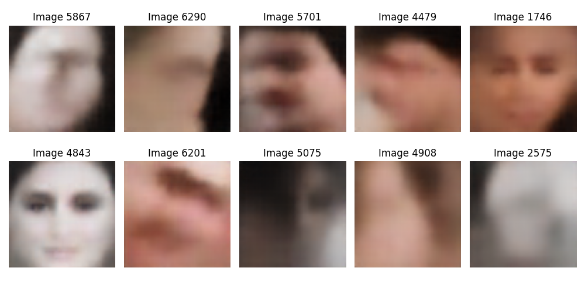

# Age-Detection-Actors-Challenge

[![Contributors][contributors-shield]][contributors-url]
[![Forks][forks-shield]][forks-url]
[![Stargazers][stars-shield]][stars-url]
[![Issues][issues-shield]][issues-url]
[![MIT License][license-shield]][license-url]


<!-- PROJECT LOGO -->
<br />
<p align="center">
  <a href="https://github.com/daca1897/Age-Detection-Actors-Challenge">
    
  </a>

  <h3 align="center"> Age detection Challenge </h3>

  <p align="center">
    Facial feature analysis has always been a topic of interest mainly due to its applicability. Deep Learning techniques are now making it possible for face analysis to be not just a dream but a reality. This practice problem is get you more acquainted with deep learning. <a href="https://datahack.analyticsvidhya.com/contest/practice-problem-age-detection"> Link
    <br />
    <a href="https://github.com/daca1897/Age-Detection-Actors-Challenge"><strong>Explore the docs »</strong></a>
    <br />
    <br />
    <a href="https://github.com/daca1897/Age-Detection-Actors-Challenge">View Demo</a>
    ·
    <a href="https://github.com/daca1897/Age-Detection-Actors-Challenge/issues">Report Bug</a>
    ·
    <a href="https://github.com/daca1897/Age-Detection-Actors-Challenge/issues">Request Feature</a>
  </p>
</p>


<!-- TABLE OF CONTENTS -->
<details open="open">
  <summary><h2 style="display: inline-block">Table of Contents</h2></summary>
  <ol>
    <li>
      <a href="#about-the-project">About The Project</a>
      <ul>
        <li><a href="#built-with">Built With</a></li>
      </ul>
    </li>
    <li>
      <a href="#getting-started">Getting Started</a>
      <ul>
        <li><a href="#prerequisites">Prerequisites</a></li>
        <li><a href="#installation">Installation</a></li>
      </ul>
    </li>
    <li><a href="#usage">Usage</a></li>
    <li><a href="#roadmap">Roadmap</a></li>
    <li><a href="#contributing">Contributing</a></li>
    <li><a href="#license">License</a></li>
    <li><a href="#contact">Contact</a></li>
    <li><a href="#acknowledgements">Acknowledgements</a></li>
  </ol>
</details>

<!-- ABOUT THE PROJECT -->
## About The Project
Proyecto to [Age detection Challenge](https://datahack.analyticsvidhya.com/contest/practice-problem-age-detection/#LeaderBoard).

### Built With
* [opencv](https://opencv.org/)
* [tensorflow](https://www.tensorflow.org/)

<!-- GETTING STARTED -->
## Getting Started
To get a local copy up and running follow these simple steps.

### Prerequisites
Download the file `shape_predictor_68_face_landmarks.dat.bz2` contained in the `repository https://github.com/othneildrew/Best-README-Template`, unzip it and save the file `shape_predictor_68_face_landmarks.dat` inside the repository.

### Installation

1. Clone the repo
   ```sh
   git clone https://github.com/TEAM-IMT/Age-Detection-Actors-Challenge.git
   ```
2. Install requerements
   ```sh
   python3 -m pip install -U requirements.
   ```

<!-- USAGE EXAMPLES -->
## Usage
In python, import de `processing.py` library and use it as well as:
```python
   from libraries.processing import Preprocessing

   preproc = Preprocessing(gray_scale, resize, normalize, rotate, vae_weight_path)
```

Where each variable is:
* `gray_scale` : Flag to return each variable in gray_scale format (`default = False`)
* `resize` : Tuple with new `(heigh, width)` desired (`default = (None, None)`)
* `normalize` : Flag to normalize each image (`default = False`)
* `rotate` : `shape_predictor_68_face_landmarks.dat` path (`default = None` -> No rotate)
* `vae_weight_path` : Path with default weights to VAE model (`default = None` -> No encode)

Then, you can use 2 functions:
```python
   image = preproc.image_read(ipath)
   images = preproc.images_processing(ilist)
```
* `preproc.image_read(str)` : Read and process a image and return it in numpy.array format
* `preproc.images_processing(list or directory)` : Read multiple images and return them into a batch (`(N, heigh, width, color)` or `(N, heigh, width)`, depends of `gray_scale` value)

<!-- ROADMAP -->
## Roadmap

See the [open issues](https://github.com/daca1897/Age-Detection-Actors-Challenge/issues) for a list of proposed features (and known issues).


<!-- CONTRIBUTING -->
## Contributing

Contributions are what make the open source community such an amazing place to be learn, inspire, and create. Any contributions you make are **greatly appreciated**.

1. Fork the Project
2. Create your Feature Branch (`git checkout -b feature/AmazingFeature`)
3. Commit your Changes (`git commit -m 'Add some AmazingFeature'`)
4. Push to the Branch (`git push origin feature/AmazingFeature`)
5. Open a Pull Request


<!-- LICENSE -->
## License

Distributed under the MIT License. See `LICENSE` for more information.


<!-- CONTACT -->
## Contact

<!-- Your Name - [@twitter_handle](https://twitter.com/twitter_handle) - email

Project Link: [https://github.com/github_username/repo_name](https://github.com/github_username/repo_name) -->


<!-- ACKNOWLEDGEMENTS -->
## Acknowledgements


<!-- MARKDOWN LINKS & IMAGES -->
<!-- https://www.markdownguide.org/basic-syntax/#reference-style-links -->
[contributors-shield]: https://img.shields.io/github/contributors/daca1897/Age-Detection-Actors-Challenge.svg?style=for-the-badge
[contributors-url]: https://github.com/daca1897/Age-Detection-Actors-Challenge/graphs/contributors
[forks-shield]: https://img.shields.io/github/forks/daca1897/Age-Detection-Actors-Challenge.svg?style=for-the-badge
[forks-url]: https://github.com/daca1897/Age-Detection-Actors-Challenge/network/members
[stars-shield]: https://img.shields.io/github/stars/daca1897/Age-Detection-Actors-Challenge.svg?style=for-the-badge
[stars-url]: https://github.com/daca1897/Age-Detection-Actors-Challenge/stargazers
[issues-shield]: https://img.shields.io/github/issues/daca1897/Age-Detection-Actors-Challenge.svg?style=for-the-badge
[issues-url]: https://github.com/daca1897/Age-Detection-Actors-Challenge/issues
[license-shield]: https://img.shields.io/github/license/daca1897/Age-Detection-Actors-Challenge.svg?style=for-the-badge
[license-url]: https://github.com/daca1897/Age-Detection-Actors-Challenge/blob/master/LICENSE
[linkedin-shield]: https://img.shields.io/badge/-LinkedIn-black.svg?style=for-the-badge&logo=linkedin&colorB=555
[linkedin-url]: https://linkedin.com/in/github_username
